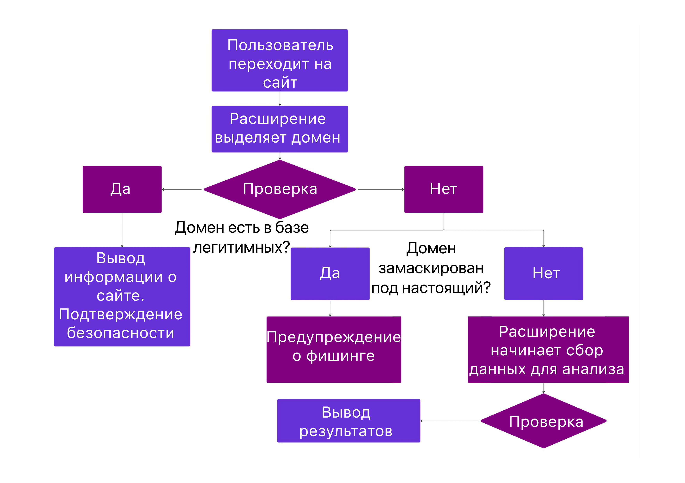
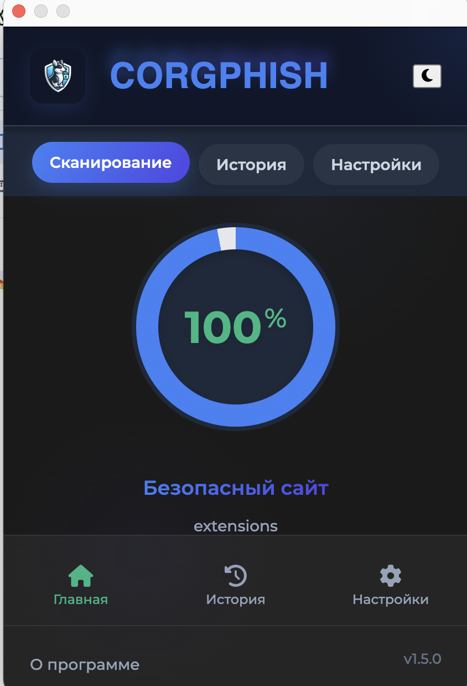
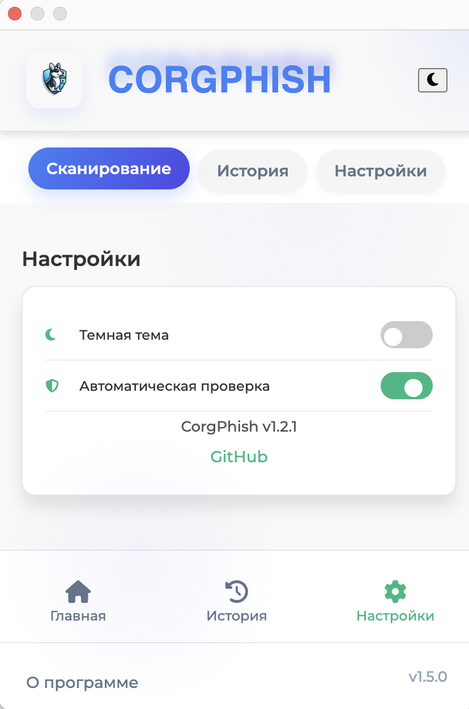
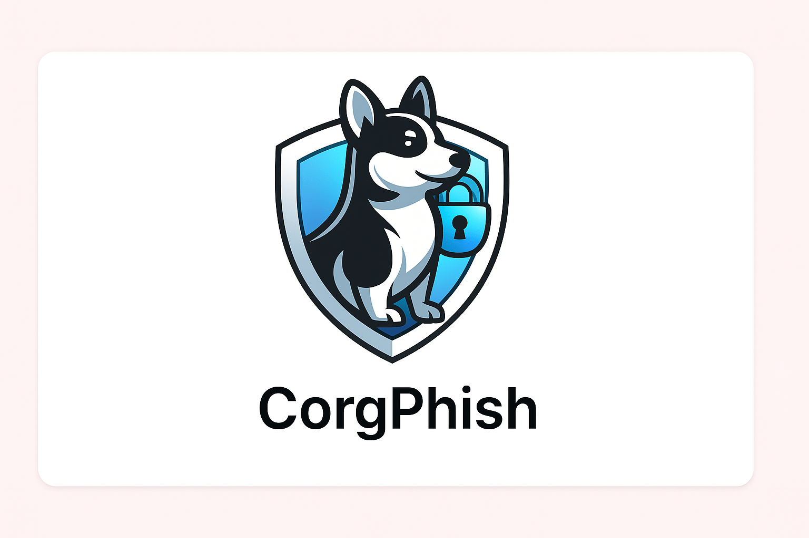

# CorgPhish: Интеллектуальная система защиты от фишинга

<div align="center">
  
  <br/>
  
  [](https://github.com/physcorgi/CorgPhish/releases)
  [](LICENSE.md)
  [](docs/CONTRIBUTING.md)
  [](https://github.com/physcorgi/CorgPhish/stargazers)
  [](docs/CODE_OF_CONDUCT.md)
  [](docs/SECURITY.md)
  [](https://github.com/physcorgi/CorgPhish/commits/master)
  
  <h3>🔒 Умная защита от фишинга в режиме реального времени 🔒</h3>
  
  <p>
    <a href="docs/INSTALLATION.md">Установка</a> •
    <a href="docs/guides/USER_GUIDE.md">Документация</a> •
    <a href="docs/CONTRIBUTING.md">Вклад в проект</a> •
    <a href="https://github.com/physcorgi/CorgPhish/issues">Сообщить об ошибке</a> •
    <a href="https://github.com/physcorgi/CorgPhish/discussions">Обсуждения</a>
  </p>
  
  
</div>

## 🚀 Основные возможности

- **🔍 Мгновенное обнаружение** фишинговых сайтов на основе AI/ML
- **🔒 Автономная работа** без отправки данных на сервер
- **🧠 Многофакторный анализ** более 50 признаков фишинга
- **⚠️ Визуальные предупреждения** о потенциальных угрозах
- **📊 Подробная информация** о факторах риска
- **⚡ Низкое потребление ресурсов** и быстрая работа
- **🛡️ Интеграция с Google Safe Browsing API** (опционально)
- **🔬 Режим глубокого сканирования** для продвинутого анализа

<div align="center">
  <h3>Точность обнаружения 97.2%</h3>
</div>

## 📊 Эффективность

<table align="center">
  <tr>
    <td align="center"><b>Точность (Accuracy)</b></td>
    <td align="center"><b>Precision</b></td>
    <td align="center"><b>Recall</b></td>
    <td align="center"><b>F1-Score</b></td>
    <td align="center"><b>Время отклика</b>
  </tr>
  <tr>
    <td align="center">97.2%</td>
    <td align="center">96.5%</td>
    <td align="center">95.8%</td>
    <td align="center">96.1%</td>
    <td align="center">120 мс</td>

  </tr>
</table>

## 🔍 Как это работает

<div align="center">
  
</div>

1. При посещении веб-страницы расширение автоматически анализирует её содержимое
2. Расширение извлекает более 50 признаков из URL и DOM-структуры страницы
3. Модель машинного обучения вычисляет вероятность того, что сайт является фишинговым
4. Пользователю отображается результат анализа и рекомендации

<div align="center">
  <code>Загрузка страницы → Извлечение признаков → Анализ модели ML → Оценка риска → Уведомление пользователя</code>
</div>

## 📸 Скриншоты

<div align="center">
  

  

</div>

<details>
<summary>📊 Примеры обнаружения</summary>

### Пример 1: Поддельный сайт банка
```
URL: https://bank-secure-login.example.com/
Обнаруженные признаки:
- Несоответствие домена и контента
- Подозрительная форма авторизации
- Отсутствие HTTPS
Вероятность фишинга: 98.7%
```

### Пример 2: Имитация страницы входа в социальную сеть
```
URL: https://faceb00k-security.example.org/login
Обнаруженные признаки:
- Опечатки в домене
- Сбор чувствительных данных
- Перенаправление на подозрительные домены
Вероятность фишинга: 96.3%
```
</details>

## 📥 Быстрый старт

```bash
# Клонировать репозиторий
git clone https://github.com/physcorgi/CorgPhish.git
cd CorgPhish

# Установить зависимости
pip install -r requirements.txt

# Собрать проект
python3 build.py

# Загрузить расширение в браузер из папки dist/browser_extension
```

Подробная инструкция: [Руководство по установке](docs/INSTALLATION.md)

## 🛠️ Технологии

<div align="center">
  
  
  
  
  

[//]: # (  )

[//]: # (  )
</div>

## 📚 Документация

- [Полная документация проекта](docs/PROJECT_DOCUMENTATION.md)
- [Руководство по установке](docs/INSTALLATION.md)
- [Структура проекта](docs/PROJECT_STRUCTURE.md)
- [Руководство для разработчиков](docs/guides/DEVELOPER_GUIDE.md)
- [Руководство пользователя](docs/guides/USER_GUIDE.md)

## 🔄 Дорожная карта


### Последние обновления
- [x] Реализация базовой функциональности обнаружения
- [x] Создание пользовательского интерфейса
- [x] Разработка демонстрационной среды
- [x] Реорганизация структуры проекта
- [x] Режим "Глубокого сканирования" для детального анализа
- [x] Улучшенная интеграция с Google Safe Browsing API
- [x] Аналитика фишинговых угроз с графиками и статистикой
- [x] Переработанный интерфейс настроек

### Следующие шаги
- [ ] История проверок с возможностью экспорта
- [ ] Централизованная база данных фишинговых образцов
- [ ] Географическая статистика угроз
- [ ] Локализация на дополнительные языки
- [ ] Публикация в магазинах расширений

## 👥 Вклад в проект

<div align="center">
  
</div>

Мы приветствуем любую помощь в развитии проекта! Ознакомьтесь с [руководством по внесению вклада](docs/CONTRIBUTING.md) для получения дополнительной информации.

## 📝 Лицензия

<div align="center">
  
</div>

Этот проект лицензирован в соответствии с лицензией MIT - см. файл [LICENSE.md](LICENSE.md) для получения дополнительной информации.

## 📢 Контакты

- Сайт проекта: [https://physcorgi.github.io/CorgPhish](https://physcorgi.github.io/CorgPhish)
- GitHub: [https://github.com/physcorgi/CorgPhish](https://github.com/physcorgi/CorgPhish)
- Email: physcorgi@proton.me
- Telegram: @physcorgi

---

<div align="center">
    <p>
        <em>Защищайте свои данные.<br/>
        Будьте на шаг впереди киберпреступников.</em>
    </p>
    <p>
        <strong>CorgPhish</strong> - Умная защита от фишинга<br/>
        <strong>Дата релиза:</strong> 18 апреля 2025 года | <strong>Версия:</strong> 1.0.1
    </p>
    
    
</div>
